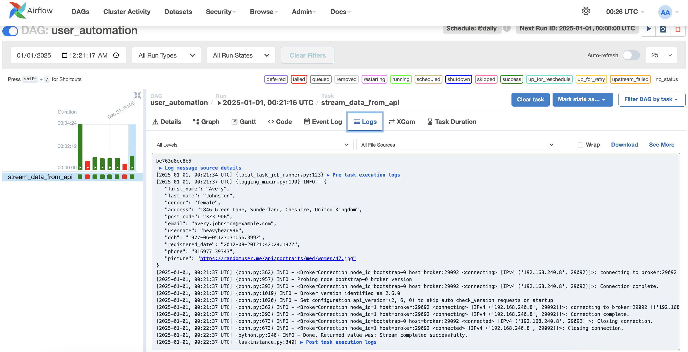
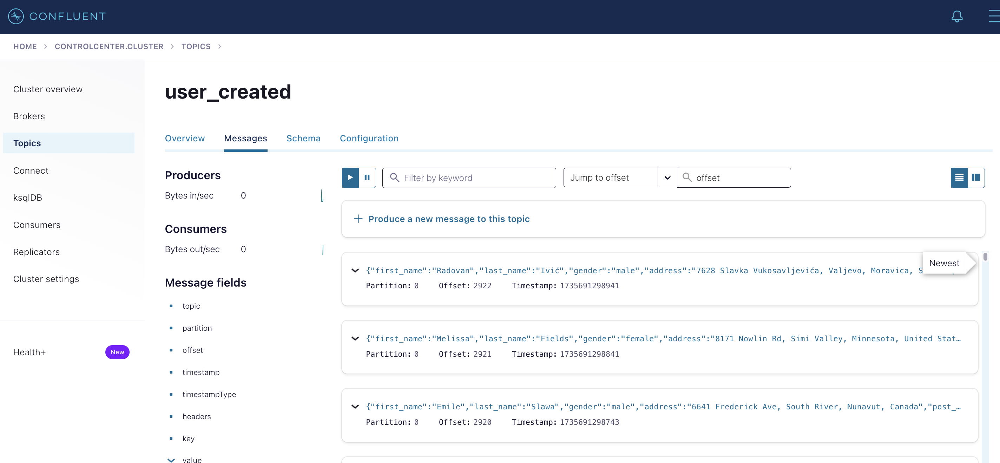
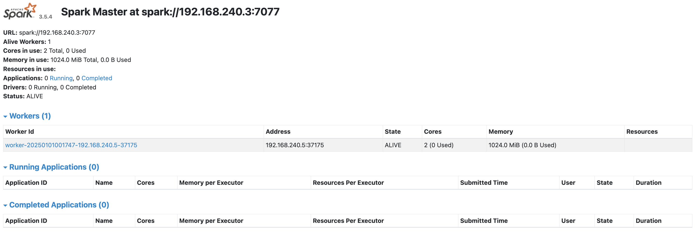
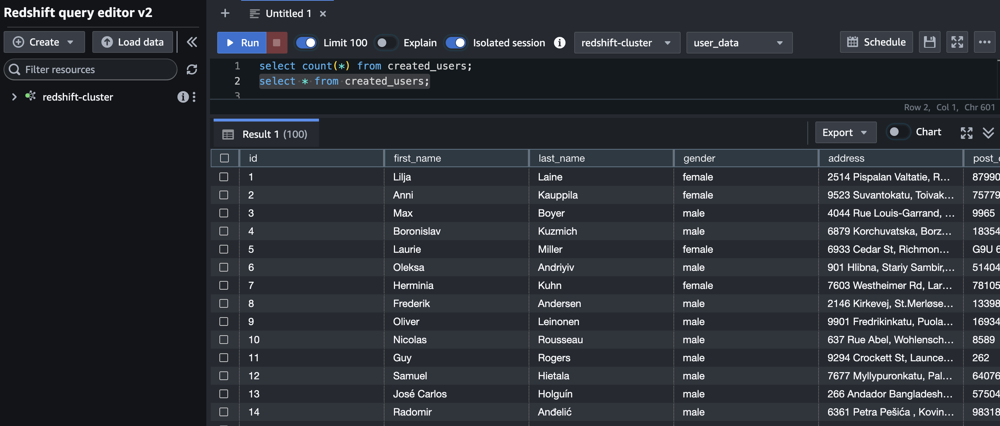

# Real-Time Streaming Data Pipeline Project

## TechStack
     

## Table of Contents

1. 📝 [Introduction](#introduction)
2. 📜 [Project Overview](#project-overview)
3. 🛠️ [Technologies Used](#technologies-used)
4. 🗂️ [Project Structure](#project-structure)
5. 🔄 [Workflow](#workflow)
6. 🛠️ [Setup Instructions](#setup-instructions)
7. 🌟 [Key Learnings](#key-learnings)

---

## 📝 Introduction

This project 📂 demonstrates a real-time data streaming pipeline 🕒 using modern technologies like Apache Kafka 🐘, Apache Spark 🌟, and Amazon Redshift 🚀, orchestrated with Terraform 🌍 for infrastructure management and Docker 🐳 for containerization. The focus is on processing real-time events with Spark Structured Streaming ⚡, integrating Kafka as the message broker 📢, and storing processed data in Redshift for analytics 📊.

This repository showcases the integration of these technologies for scalable, reliable, and efficient real-time data processing 🏗️. By leveraging these cutting-edge tools, the project demonstrates how to transform raw event streams into meaningful insights in real time, showcasing practical applications across industries.

With this approach, users can learn how to implement data-driven solutions that are robust 🔒, dynamic 🌐, and tailored to solve real-world challenges. This project introduces a comprehensive way to use state-of-the-art technologies for handling high-volume, real-time data while ensuring accuracy, consistency, and flexibility for future expansion 🚀.

---

## 📜 Project Overview

The pipeline is designed to process user creation events 👤 from a Kafka topic 📡, transform the data using Spark Structured Streaming ✨, and store the results in a Redshift database 🗄️. The data pipeline supports scalability 📈, resilience 🛡️, and real-time processing ⏱️, making it suitable for industrial applications like monitoring systems 🛠️, IoT 🌐, e-commerce analytics 🛍️, and customer behavior analysis. This approach enhances decision-making, optimizes operational efficiency, and provides a framework for building advanced real-time solutions.

The project stands as an example of how modern technologies can synergize to deliver a seamless flow of information, ensuring timely responses to critical events and uncovering actionable insights 🌟. Whether it’s handling IoT device logs or analyzing customer purchasing patterns, the architecture is built to cater to demanding data-driven scenarios.

---

## 🛠️ Technologies Used

### 1. 

- **Purpose**: Kafka serves as the message broker 📤, enabling the streaming of real-time user events.
- **Key Features**: Scalability 🔄, fault tolerance 🛡️, high throughput ⚡, and distributed architecture.

### 2. 

- **Purpose**: Used for real-time data transformation and processing with Spark Structured Streaming.
- **Key Features**: Distributed data processing ⚙️, fault tolerance 🔒, seamless integration with Kafka, and support for large-scale datasets.

### 3. 

- **Purpose**: Serves as the data warehouse 🏢 for storing processed user data.
- **Key Features**: Scalability 📈, analytics optimization 📊, columnar storage for performance, and integration with other AWS services.

### 4. 

- **Purpose**: Manages infrastructure as code 🖥️ to provision resources like Redshift and S3 buckets.
- **Key Features**: Declarative syntax 🖋️, automation 🤖, cloud-agnostic capabilities ☁️, and version control for infrastructure.

### 5. 

- **Purpose**: Provides a containerized environment for running services like Kafka, Spark, and Airflow.
- **Key Features**: Portability 📦, scalability 📊, simplified deployment 🚀, and support for reproducible environments.

### 6. 🌬️ 

- **Purpose**: Orchestrates the data pipeline workflow.
- **Key Features**: Task scheduling 🗓️, monitoring 📈, error handling 🛠️, and DAG-based workflows.

---

## 🗂️ Project Structure

```
project-root/
├── dags/                          # For Airflow DAGs (if used)
├── data/                          # Python virtual environment (added to .gitignore)
├── logs/                          # Logs for debugging 🛠️
├── terraform/                     # Terraform configurations 🌍
│   ├── main.tf                    # Redshift connection and configurations 🗄️
│   ├── providers.tf               # Providers configuration 🌐
│   ├── variables.tf               # Variables definition 📋
│   ├── outputs.tf                 # Outputs definition 📤
│   ├── table_schema.sql           # SQL script to create table schema 📄
├── script/                        # Utility Airflow scripts 🛠️
│   ├── entrypoint.sh              # Entry point script for  🚀
├── main/                          # Main Spark job scripts 🐍
│   ├── spark_stream.py            # Spark streaming job
│   ├── test_kafka.py              # Test run for Kafka streaming 🐘
│   └── __init__.py                # Package initialization 📦
├── .gitignore                     # Git ignore rules 🚫
├── docker-compose.yml             # Docker Compose configuration 🐳
├── requirements.txt               # Python dependencies 📋
├── README.md                      # Documentation 📝
```

---

## 🔄 Workflow

### Step-by-Step Process

1. **Airflow DAG: Fetching and Streaming Data**
   
   

   - A custom Airflow DAG (`user_automation`) fetches user data from a publicly available API (e.g., `https://randomuser.me`).
   - The DAG orchestrates the task of fetching data and sending it to the Kafka producer topic `user_created`.
   - **Fields Extracted**: `id`, `first_name`, `last_name`, `gender`, `address`, `post_code`, `email`, `username`, `registered_date`, `phone`, and `picture`.

2. **Kafka Producer Configuration**:

   

   - Kafka is configured to accept incoming user data streamed in real time by the Airflow DAG.
   - Messages are serialized in JSON format before publishing.
   - Dockerized Kafka brokers ensure easy scalability and maintenance.

3. **Spark Structured Streaming**:

   - Spark is configured using `spark-sql-kafka` JARs for seamless Kafka integration.
   - A custom schema parses incoming Kafka messages.
   - Transformations include:
     - Adding a `date_added` column (current timestamp).
     - Validating records and logging invalid entries.

4. **Data Pipeline Configuration**:

   

   - Data flows into Spark for real-time processing.
   - The transformed data is written to Amazon Redshift via JDBC.

5. **Redshift Setup via Terraform**:

   

   - Terraform provisions the following:
     - A single-node Redshift cluster (`user_data` database).
     - Necessary IAM roles for secure S3 integration (if staging is needed).
     - A table schema with fields including the `date_added` column.

6. **Dockerized Network**:

   

   - Services such as Kafka, Spark, Zookeeper, and Airflow run on a single Docker network.
   - Docker Compose simplifies service orchestration for local development.

7. **End-to-End Data Flow**:

   - The pipeline starts with the Airflow DAG fetching API data, sending it to Kafka.
   - Spark consumes the Kafka messages, processes them, and writes to Redshift.
   - Logs are stored locally for debugging and monitoring.

---

## 🛠️ Setup Instructions

### Prerequisites

- 🐳 Docker installed on your machine.
- 🌍 Terraform installed.
- 🐍 Python 3.8 or above.
- ☁️ AWS credentials with necessary permissions (Redshift, S3).

### Steps

#### 1. **Clone the Repository**

```bash
git clone <repository-url>
cd project-root
```

#### 2. **Set Up Environment Variables**

Create a `.env` file:

```env
REDSHIFT_JDBC_URL=jdbc:redshift://<redshift-cluster-endpoint>:5439/user_data
REDSHIFT_USERNAME=admin_user_01
REDSHIFT_PASSWORD=<your-password>
KAFKA_BROKER=localhost:9092
```

#### 3. **Install Python Dependencies**

Activate your virtual environment and install dependencies:

```bash
source data/bin/activate
pip install -r requirements.txt
```

#### 4. **Run Terraform**

Navigate to the Terraform directory and apply configurations:

```bash
cd terraform
terraform init
terraform apply
```

#### 5. **Run Docker Compose**

Start Kafka, Zookeeper, and other services:

```bash
docker-compose up -d
```

#### 6. **Run the Airflow DAG**

Start the Airflow scheduler and webserver, then trigger the `user_automation` DAG.

#### 7. **Run the Python Script**

Execute the main script to start streaming:

```bash
python main/main.py
```

---

## 🌟 Key Learnings

1. **Real-Time Data Streaming**:

   - Understanding Kafka's producer-consumer architecture 🐘, including partitioning and offset management.
   - Leveraging Spark Structured Streaming ⚡ for scalable processing and fault-tolerant computations.

2. **Infrastructure as Code (IaC)**:

   - Automating infrastructure setup with Terraform 🌍 for consistency and scalability.
   - Managing changes to cloud resources through version-controlled configurations.

3. **Data Warehouse Integration**:

   - Writing streaming data into Amazon Redshift 🗄️ for analytics with optimized query performance.
   - Structuring data for effective business intelligence insights.

4. **Containerization**:

   - Simplifying deployment using Docker 🐳 and Docker Compose 🧩 for reproducible environments.
   - Isolating dependencies and ensuring consistent setups across systems.

5. **Integration of Airflow, Spark, and Kafka**:

   - Configuring Airflow to orchestrate API-based data collection and Kafka message production.
   - Setting up a Spark Kafka consumer 🌟 for real-time event ingestion.
   - Handling schema evolution and data enrichment dynamically.

6. **Best Practices**:

   - Organizing repositories 🗂️ for maintainability and scalability 📈.
   - Securing sensitive information using environment variables 🔐.
   - Implementing logging and monitoring for observability.

This repository 📂 exemplifies the integration of modern data engineering tools 🛠️ and techniques 🧠 for building robust 💪 and scalable 📈 real-time data pipelines ⚡. It lays the groundwork for developing production-ready systems with enhanced analytics capabilities.

